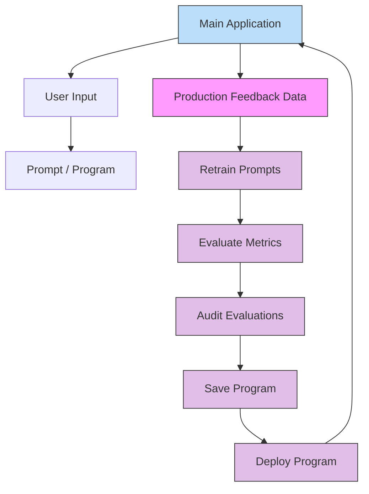

# DsPy - Declarative Self-improving Python 
DSPy is a framework for building and optimizing LLM programs using declarative components. This repo provides concise, hands-on examples that show why DSPy outperforms prompt-only approaches in real projects.

- DSPy website: https://dspy.ai/
- DSPy GitHub: https://github.com/stanfordnlp/dspy

# Why DSPy Beats Prompt-Only Systems

- 🧩 **Programs, Not Prompts**: Build typed modules and pipelines instead of brittle string templates.
- 📊 **Data-Driven Optimization**: Learn the best prompts and examples from real data, automatically.
- 🧠 **Reasoning You Can Trust**: Compose chain-of-thought steps without manual prompt tinkering.
- ✅ **Eval-First Workflow**: Measure quality with built-in evaluations and track regressions.
- 🚀 **Ready for Production**: Versioned configs, repeatable runs, and vendor-agnostic deployment.
- 🔁 **Continuous Improvement**: Feedback loops make the system better as usage grows.

**Result?** AI systems that stay reliable and improve as new data arrives.

# Documentation

To understand the importance of the DSPy framework, we need to understand the potential pain points of prompt engineering.

This repository provides practical examples comparing traditional manual prompt engineering with DSPy-based declarative programming.

- [1. Prompt Engineering Problems](docs/1.Prompt_Engineering.md) - Explore common challenges in prompt engineering and how DSPy addresses them.
- [2. Multi-Stage Workflow](docs/2.Multi-Stage%20Workflow.md) - See how DSPy enables modular, reusable pipelines for complex tasks.
- [3. Tool Calling and Reasoning](docs/3.Tool%20Calling.md) - Learn how DSPy structures reasoning and tool use for better performance and auditability.
- [4. Few-Shot Learning and Training](docs/4.FewShotLearning-Training.md) - Understand how DSPy automates few-shot example selection and optimization.
- [5. Optimizers](docs/5.Optimizers.md) - Explore how DSPy optimizes prompts and few-shot examples using COPRO and MIPROv2.

# DsPy MlOps Lifecycle

The following diagram illustrates the simplified DsPy MLOps lifecycle, from user interaction to continuous improvement:



### Explanation

1. **Main Application**: The core application that serves user requests and logs interactions.
2. **Production Feedback Data**: Real-world data collected from user interactions (e.g., corrections, ratings) used to improve the system.
3. **Retrain Prompts**: Using the feedback data to optimize instructions and few-shot examples (via MIPRO/COPRO).
4. **Evaluate Metrics**: Rigorous testing of the new prompts against a held-out devset to ensure quality.
5. **Audit Evaluations**: Human or automated review of the evaluation results to catch regressions.
6. **Save & Deploy**: Versioning the optimized program and updating the main application.

# Local Setup

- Open this solution in dev container mode
- Run the following command to activate environment
```sh
make print
```
- Go through the documents inside docs folder to understand the concepts
- Run the python files to see the results
- Make sure `mlflow` is enabled for Local Debugging

- Run the following command to enable mlflow server
```sh
mlflow server --backend-store-uri sqlite:///mydb.sqlite
```